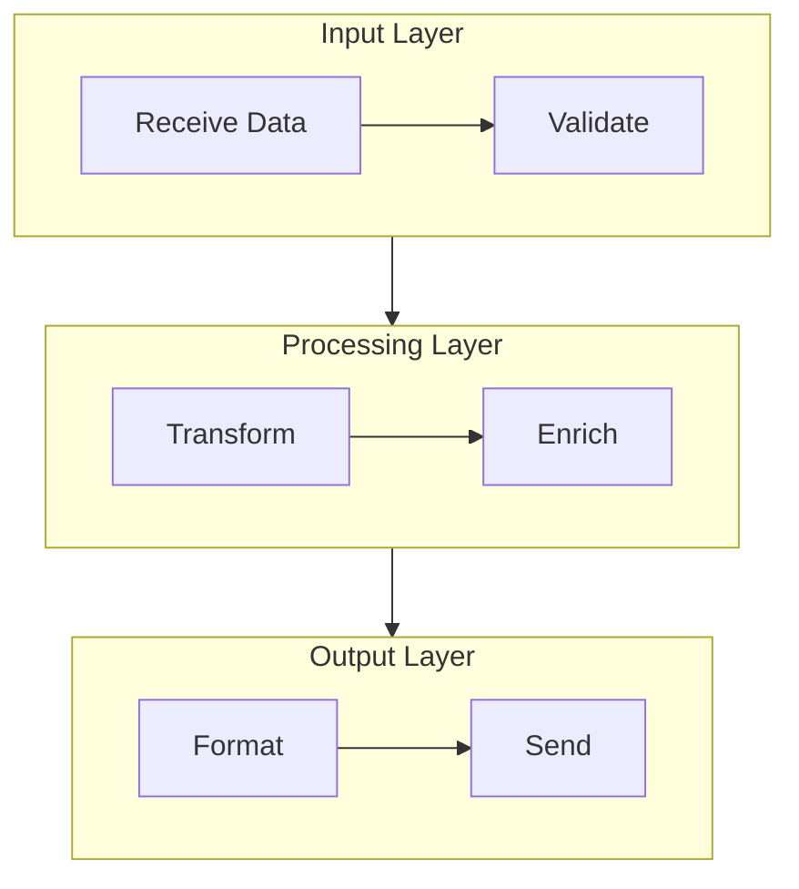

## Prompt-to-Diagram Translation Heuristics

When receiving a natural language prompt, follow this cognitive pipeline:

### Step 1: Identify Entities
Extract nouns/actors → these become **nodes** or **participants**

### Step 2: Identify Relationships
Extract verbs/actions/arrows → these become **edges** or **messages**

### Step 3: Identify Conditions
Extract "if/else", "when", "depending on" → these become **decision nodes** (`{}`) or `alt` blocks

### Step 4: Identify Groupings
Extract "part of", "within", "module", "phase" → these become **subgraphs** or **sections**

### Step 5: Select Diagram Type
Consider what's the intent of the diagram requested, and pick the best type.

### Step 6: Generate & Validate
Produce the Mermaid code → run through the Quality Checklist

## Universal Syntax Rules (CRITICAL)

These rules apply across **all** diagram types and must never be violated.

### Node & Label Quoting
```
✅ CORRECT:  id["Node Name"]
❌ WRONG:    id[Node Name]     (breaks on special characters)
```
- **ALWAYS** wrap node display names in double quotes inside brackets.
- This prevents parsing errors from spaces, special characters, and reserved words.

### Edge Label Quoting
```
✅ CORRECT:  A -->|"label text"| B
❌ WRONG:    A -->|label text| B
```
- **ALWAYS** wrap edge labels in double quotes.

### Special Characters
| Character | Code     |
|-----------|----------|
| `"`       | `#quot;` |
| `<`       | `#lt;`   |
| `>`       | `#gt;`   |

### Reserved Word Avoidance
- Use `END` (uppercase) as node ID for terminal/end nodes in flowcharts. Lowercase `end` is a **reserved keyword** and will cause parse errors.
- Avoid using `subgraph`, `click`, `style`, `class`, `default` as node IDs.

### Numbered Steps
```
✅ CORRECT:  id["(1) First Step"]
❌ WRONG:    id["1. First Step"]    (period can conflict with parsing)
```

### Avoid obsolete keywords
```
✅ CORRECT:  flowchart TD
❌ WRONG:    graph TD       (deprecated alias, less predictable)
```
- Always use `flowchart` instead of `graph`.

### Line breaks in labels
```
✅ CORRECT:  `"Line 1<br/>Line 2"`
❌ WRONG:    `"Line 1\nLine 2"`
```
- Mermaid uses HTML breaks

## Diagram Type Profiles: When to Use, Key Elements, Checklist

Each profile below defines:
- **USE WHEN**: The precise scenario where this diagram is the best fit
- **DON'T USE WHEN**: Common misapplications
- **KEY ELEMENTS**: The structural components that *must* appear for the diagram to be useful
- **ELEMENT CHECKLIST**: A quick verification list before output

### Flowchart (`flowchart TD` / `flowchart LR`)

**USE WHEN:**
- Documenting a step-by-step process, algorithm, or workflow
- Showing decision branches (yes/no, if/else)
- Mapping approval chains, onboarding flows, CI/CD pipelines
- Explaining "how does X work?"

**DON'T USE WHEN:**
- Focus is on messages *between* systems (→ use Sequence)
- Focus is on an entity's state changes (→ use State Diagram)
- There are no branching/sequential steps (→ consider Mindmap or other)

**VARIANTS:**

- `TD` (top-down) for hierarchies
- `LR` (left-right) for pipelines

**KEY ELEMENTS:**

| Element | Shape / Syntax | Purpose | Required? |
|---|---|---|---|
| **Begin Node** | `A@{ shape: circle, label: "Begin"}` | Entry point | ✅ Yes |
| **End Node** | `A@{ shape: dbl-circ, label: "End"}` | Exit point(s) | ✅ Yes |
| **Process Steps** | `A@{ shape: rect, label: "Action"}` | Core actions | ✅ Yes |
| **Decision Points** | `A@{ shape: diamond, label: "Question?"}` | Branch logic | ✅ If any branching exists |
| **Decision Labels** | `\|"Yes"\|` / `\|"No"\|` | Branch outcomes | ✅ On every decision edge |
| **Conditional Prep** | `A@{ shape: hex, label: "Prepare conditional" }` | Setup before a decision (loop init, flag set) | 🔶 When pre-decision logic needs distinction |
| **Manual Operation** | `A@{ shape: trap-t, label: "Manual operation" }` | Human-performed step | 🔶 When distinguishing manual from automated |
| **I/O Nodes** | `A@{ shape: lean-r, label: "Input Data"}` | User input or data output | 🔶 When data enters/leaves the flow |
| **Subroutine / Subprocess** | `A@{ shape: subproc, label: "Validate()"}` | Reusable process defined elsewhere | 🔶 When delegating to a sub-flow |
| **Database** | `A@{ shape: cyl, label: "Users"}` | Persistent data reads/writes | 🔶 When data storage is relevant |
| **Disk Storage** | `A@{ shape: lin-cyl, label: "Disk storage" }` | File system or disk-based persistence | 🔶 When distinguishing disk from database |
| **Document Node** | `A@{ shape: doc, label: "Document" }` | Reports, files, or generated output | 🔶 When a document artifact is produced |
| **Event Node** | `A@{ shape: rounded, label: "This is an event" }` | Triggered or emitted events | 🔶 When
modeling event-driven steps |
| **Connector / Junction** | `A@{ shape: fork }` | Merge multiple paths without a label | 🔶 When flow lines would otherwise cross |
| **Delay Node** | `A@{ shape: delay, label: "Delay" }` | Wait states, timeouts, scheduled pauses | 🔶 When timing or waiting is significant |
| **Comment / Annotation** | `A@{ shape: braces, label: "Comment"` | Inline diagram notes tied to a specific node | 🔶 For clarity on complex steps |
| **Solid Edges** | `A --> B` | Default directional flow between steps | ✅ Yes |
| **Dotted Edges** | `A -.-> B` | Optional, async, or low-priority paths | 🔶 When flow is conditional or non-blocking |
| **Labeled Dotted Edges** | `A -.->\|"label"\| B` | Optional flows that still need branch clarity | 🔶 When dotted branch outcomes differ |
| **Thick Edges** | `A ==> B` | Critical path or high-priority flow | 🔶 When emphasizing the main happy path |
| **Open Links** | `A --- B` | Undirected association or structural grouping annotation | 🔶 Rarely; for non-flow relationships |
| **Subgraphs** | `subgraph name["Label"]` | Logical grouping of steps | 🔶 When >10 nodes or distinct phases |

When a flowchart exceeds ~12 nodes, partition into logical subgraphs:


**ELEMENT CHECKLIST:**
- [ ] Clear start and end nodes present
- [ ] Meaningful labels on all nodes (do NOT call them A, B, etc)
- [ ] Every decision diamond has labeled outgoing edges
- [ ] No dead-end nodes (every node connects to something)
- [ ] Subgraphs used if complexity > 10 nodes
- [ ] Direction matches reading order (LR for timelines, TD for hierarchies)

### Sequence Diagram (`sequenceDiagram`)

**USE WHEN:**
- Showing request/response flows between services, APIs, or actors
- Documenting authentication handshakes, payment protocols
- Explaining "what messages pass between A, B, and C?"
- Visualizing async vs sync communication patterns

**DON'T USE WHEN:**
- There's only one actor (→ use Flowchart)
- Focus is on internal logic/branching, not message exchange (→ Flowchart)
- The sequence has no meaningful temporal order

**KEY ELEMENTS:**

| Element | Syntax | Purpose | Required? |
|---|---|---|---|
| **Participants** | `participant A as "Display Name"` | Named actors/systems | ✅ Yes (2+ participants) |
| **Synchronous Messages** | `A->>B: Request` | Request calls | ✅ Yes |
| **Response Messages** | `B-->>A: Response` | Return/reply | ✅ Yes (pair every request) |
| **Self-Calls** | `A->A: Internal Logic` | Internal calls within the same participant | 🔶 When internal behavior matters | 
| **Async Messages** | `A-xB: Event` | Fire-and-forget; no reply expected (queues, notifications, jobs) | 🔶 When async/event-driven | 
| **Async Acknowledgment** | `A--xB: Ack` | Dropped/decoupled returns; webhook replies, broadcast events | 🔶 When reply is intentionally discarded | 
| **Activation Boxes** | `activate A` / `deactivate A` | Show processing duration | 🔶 Recommended for clarity |
| **Alt/Else Blocks** | `alt` / `else` / `end` | Conditional paths | 🔶 When outcomes diverge |
| **Loop Blocks** | `loop Every N seconds` / `end` | Repeated interactions | 🔶 When polling/retry exists |
| **Notes** | `Note right of A: text` | Clarifying annotations | 🔶 For important context |
| **Parallel Blocks** | `par` / `and` / `end` | Concurrent messages | 🔶 When parallelism is relevant |
| **Background Highlights** | `rect rgb(...)` / `end` | Visual grouping of phases | 🔶 For readability in long diagrams |

**ELEMENT CHECKLIST:**
- [ ] All actors declared as participants at the top
- [ ] Every request has a corresponding response (unless fire-and-forget)
- [ ] `activate`/`deactivate` pairs are balanced
- [ ] Alt/else used for error paths or conditional behaviors
- [ ] Participants ordered left-to-right by interaction frequency

### Class Diagram (`classDiagram`)

**USE WHEN:**
- Documenting OOP class structures, interfaces, abstract classes
- Showing inheritance hierarchies, composition, associations
- Designing or explaining software architecture at the code level
- Describing design patterns (Factory, Observer, Strategy, etc.)

**DON'T USE WHEN:**
- Focus is on database tables with cardinalities (→ ER Diagram)
- There are no methods or behavioral contracts — just data (→ ER Diagram)
- User wants a simple taxonomy/hierarchy (→ Mindmap)

**KEY ELEMENTS:**

| Element | Syntax | Purpose | Required? |
|---|---|---|---|
| **Classes** | `class ClassName { }` | Core entities | ✅ Yes |
| **Attributes** | `+String name` | Data fields with visibility | ✅ Yes (at least key fields) |
| **Methods** | `+getName() String` | Behaviors/contracts | 🔶 When behavior matters |
| **Visibility Modifiers** | `+` public, `-` private, `#` protected, `~` internal | Access control | ✅ Yes |
| **Inheritance** | `Parent <\|-- Child` | Is-a relationships | 🔶 When hierarchy exists |
| **Composition** | `Whole *-- Part` | Strong ownership | 🔶 When applicable |
| **Aggregation** | `Container o-- Item` | Weak ownership | 🔶 When applicable |
| **Association** | `A --> B` | General relationship | 🔶 As needed |
| **Dependency** | `A ..> B` | Uses/depends on (weaker than association) | 🔶 As needed |
| **Realization** | `Class ..\|> Interface` | Implements an interface/contract | 🔶 When interfaces are used |
| **Interfaces** | `class IName { <<interface>> }` | Contracts | 🔶 When relevant |
| **Annotations** | `<<abstract>>`, `<<service>>`, `<<enumeration>>` | Stereotypes | 🔶 For clarity |

**ELEMENT CHECKLIST:**
- [ ] All classes have at least key attributes listed
- [ ] Visibility modifiers are consistently applied
- [ ] Relationship types are semantically correct (inheritance vs composition vs aggregation)
- [ ] Abstract classes/interfaces marked with annotations
- [ ] No orphan classes (unless intentionally standalone)

### State Diagram (`stateDiagram-v2`)

**USE WHEN:**
- Documenting the lifecycle of a single entity (order, ticket, user account, etc.)
- Showing all possible states and what triggers transitions between them
- Modeling finite state machines (FSMs), UI screen states, protocol states

**DON'T USE WHEN:**
- Multiple actors interact (→ Sequence Diagram)
- Focus is on *steps performed*, not *states occupied* (→ Flowchart)
- States don't have clear named identities

**KEY ELEMENTS:**

| Element | Syntax | Purpose | Required? |
|---|---|---|---|
| **Initial State** | `[*] --> FirstState` | Entry point | ✅ Yes |
| **Final State** | `LastState --> [*]` | Terminal state(s) | ✅ Yes (if lifecycle ends) |
| **Named States** | `StateName` or `state "Display" as s1` | Entity conditions | ✅ Yes |
| **Transitions** | `StateA --> StateB : trigger` | What causes a state change | ✅ Yes (with labels) |
| **Composite States** | `state GroupName { ... }` | Sub-states within a state | 🔶 For complex states |
| **Choice Pseudo-state** | `state checkState <<choice>>` | Conditional branching | 🔶 When transitions depend on conditions |
| **Fork/Join** | `<<fork>>` / `<<join>>` | Parallel state entry/exit | 🔶 For concurrent sub-states |
| **Notes** | `note right of State : text` | Extra context | 🔶 For important constraints |

**ELEMENT CHECKLIST:**
- [ ] `[*]` start marker present
- [ ] All transitions labeled with trigger/event names
- [ ] Every state is reachable from the initial state
- [ ] Terminal states connect to `[*]` (or are explicitly marked as "stuck" states)
- [ ] No ambiguous transitions (two identical triggers from the same state)

### Entity Relationship Diagram (`erDiagram`)

**USE WHEN:**
- Designing or documenting database schemas
- Showing tables, their columns, and how they relate via foreign keys
- Communicating cardinality (one-to-one, one-to-many, many-to-many)
- Data modeling for backend systems

**DON'T USE WHEN:**
- Entities have methods/behaviors (→ Class Diagram)
- Focus is on data *flow*, not data *structure* (→ Flowchart)
- Relationships don't have meaningful cardinality

**KEY ELEMENTS:**

| Element | Syntax | Purpose | Required? |
|---|---|---|---|
| **Entities** | `ENTITY_NAME { }` | Tables/collections | ✅ Yes |
| **Attributes** | `type name PK/FK` | Columns with types | ✅ Yes (at least PK) |
| **Primary Keys** | `int id PK` | Unique identifiers | ✅ Yes |
| **Foreign Keys** | `int other_id FK` | Cross-references | ✅ Yes (when relations exist) |
| **Relationships** | `A \|\|--o{ B : "verb"` | How entities connect | ✅ Yes |
| **Cardinality** | `\|\|` Exactly-one, `\|o` / `o\|` zero-one, `}o` / `o{` zero-many, `}\|` / `\|{` one-many | How many entities on each side | ✅ Yes (on every relationship) |
| **Relationship Labels** | `: "places"` | Verb describing the relationship | ✅ Yes |

**ELEMENT CHECKLIST:**
- [ ] Meaningful name for each state (do NOT use A, B, etc)
- [ ] Every entity has a primary key marked `PK`
- [ ] Every relationship line has correct cardinality on both ends
- [ ] Foreign keys match the PK of the related entity
- [ ] Relationship labels use active verbs ("places", "contains", "belongs to")
- [ ] No many-to-many without a junction/bridge table (unless intentional)

## Disambiguation Rules

When multiple diagram types seem viable, use these priority rules:

### Rule 1: Temporal Message Exchange → Sequence Diagram
If the description involves **two or more named actors** exchanging **ordered messages**, prefer a sequence diagram over a flowchart — even if the user says "flow".

> *"Show me the flow of a user logging in via OAuth with the auth server and database"*
> → **Sequence Diagram** (multiple actors, request/response pairs)

### Rule 2: Branching Logic → Flowchart
If the description focuses on **decision points** (if/else, yes/no) leading to **different outcomes**, prefer a flowchart — even if actors are mentioned.

> *"Show me what happens when a payment is processed — if it succeeds, ship; if it fails, retry or refund"*
> → **Flowchart** (branching decisions are the core)

### Rule 3: Entity Attributes + Relationships → ER Diagram over Class Diagram
If the user mentions **tables**, **columns**, **primary keys**, **foreign keys**, or **cardinality** (one-to-many), prefer ER diagram. Use class diagram only when the user emphasizes **methods**, **inheritance**, or **OOP**.

### Rule 4: Named States with Transitions → State Diagram over Flowchart
If the description centers on an **entity that changes states** (e.g., order: pending → confirmed → shipped → delivered), prefer a state diagram. Flowcharts describe *processes*; state diagrams describe *entity lifecycles*.

### Rule 5: When Ambiguous, Ask — or Default to Flowchart
Flowcharts are the most universally understood diagram type. When truly uncertain, generate a flowchart and note to the user that an alternative type may be more suitable.

## Post-Generation Validation

After generating any diagram, run through this universal check:

1. **Type Match**: Does the chosen diagram type align with the user's actual intent?
2. **Completeness**: Are all entities/steps/actors from the user's description represented?
3. **Key Elements**: Does the diagram include all ✅ Required elements from the relevant profile above?
4. **Syntax**: Do all nodes, labels, and special characters follow the quoting rules?
5. **Readability**: Is the diagram scannable in under 10 seconds? If not, simplify or split.
6. **No Orphans**: Every node/entity connects to at least one other (unless intentionally isolated).
7. **Labels**: Every arrow/relationship is labeled where meaning isn't self-evident.

*End of SKILL file. The agent should internalize the intent detection signals, consult the decision flowchart, and populate diagrams using the element checklists for each type.*
